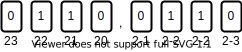

# WiseMansFixedPoint
This work implements two generic C++ fixed-point arithmetic data types. It is a new and improved version of the [PoorMansFixedPoint](https://github.com/miklhh/PoorMansFixedPoint) implementation.

## Notation
In this work we use the notation Q(*a*,*b*) to denote a fixed-point number with *a* integer bits and *b* fractional bits. Fixed-point numbers come in two different forms, signed or unsigned, and the sign of the number is specified by the context in which the fixed point number is used.

## Data types
*WiseMansFixedPoint* implements two generic fixed point data types, a signed and an unsigned type:
 * `SignedFixedPoint<int,int>`
 * `UnsignedFixedPoint<int,int>`

were the first template parameter dictates the number of integer bits in the fixed point number and the second template parameter dictates the number of fractional bits used to represent the fixed point number

### Sizes
| Operator | C++ usage | Resulting type | l |
|---|---|---| -- |
| Addition (+)   | `fixLHS<a,b> + fixRHS<c,d>` | FixedPoint<a,b> | c |
| Subtration (-) | `fixLHS<a,b> - fixRHS<c,d>` | FixedPoint<a,b> | d |A

### To write about.
 * Correct rounding when using floating point constructor.
