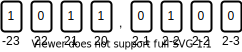

# WiseMansFixedPoint
This work implements two generic C++ fixed-point arithmetic data types. It is a new and improved version of the [PoorMansFixedPoint](https://github.com/miklhh/PoorMansFixedPoint) implementation.

## Notation
In this work we use the notation Q(*a*,*b*) to denote a fixed-point number with *a* integer bits and *b* fractional bits. Fixed-point numbers come in two different forms, signed or unsigned, and the sign of the number is specified by the context in which the fixed point number is used.

Two examples of fixed point represented numbers are shown in Fig. 1 and Fig. 2. Note especially the different weight from the most significant bit.

<div align="center"></div>
<div align="center"><p><strong>Figure 1:</strong> Example of the number 6.375 in Q(4,4) unsigned fixed point.</p></div>

<div align="center"></div>
<div align="center"><p><strong>Figure 2:</strong> Example of the number -4.75 in Q(4,4) signed fixed point.</p></div>

## Data types
*WiseMansFixedPoint* implements two generic fixed point data types, a signed and an unsigned type:
 * `SignedFixedPoint<int,int>`
 * `UnsignedFixedPoint<int,int>`

were the first template parameter dictates the number of integer bits in the fixed point number and the second template parameter dictates the number of fractional bits used to represent the fixed point number

## Operators
WiseMansFixedPoint implements the four basic arithmetic operators, *addition*, *subtraction*, *multiplication* and *division*. C++ operator overloading is used such that arithmetic expressions with fixed point numbers can be used like regular C++ floating point arithmetic expressions. The following listing and table illustrates the usage of these basic operators.

```C++
constexpr int int_a, int_b;         // Integer sizes
constexpr int frac_a, frac_b;       // Fractional sizes
SignedFixedPoint<int_a,frac_a> a;
SignedFixedPoint<int_b,frac_b> b;
```
| Operation | Resulting integer size    | Resulting fractional size | Can overflow? |
|-----------|---------------------------|---------------------------|---------------|
| `a + b`   | `std::max(int_a,int_b)+1` | `std::max(frac_a,frac_b)` | No            |
| `a - b`   | `std::max(int_a,int_b)+1` | `std::max(frac_a,frac_b)` | No            |
| `a * b`   | `int_a + int_b`           | `frac_a + frac_b`         | No            |
| `a / b`   | `int_a`                   | `frac_a`                  | Yes           |

Note especially that for all operators, except the division operator, the resulting fixed point number will not over-/underflow until an assignment operation possibly over-/underflows. The following example illustrates that.

```C++
SignedFixedPoint<4,3> a{ 7.125 };
SignedFixedPoint<3,3> b{ 4.250 };
a = a + b;
  ^   ^
  |   |
  |   | <-- <5,3>{ 11.375 }
  |
  | < -- <4,3>{ -5.375 } (overflow here!!)
```

# To write about.
 * Correct rounding when using floating point constructor.
 * Round to nearest (`rnd<7,5>(fix)`).
 * Saturation (`sat<12,13>(fix)`).
 * Compile flag `-D_SHOW_OVERFLOW_INFO`.
 * Overflow detection uses `64-INT_BITS` guard bits. This should detect overflow in all cases since a limit on how big fixed point numbers can be is imposed.
 * Conversion to double-precision floating-point uses at most 64 bits of the fixed point number in conversion (all integer bits).

# Todo:
 * The specialized `_INT128_t construct_from_double(double)` function is now speciallized for signed integers only, and should be moved and specialized in the signed and unsigned types.
 * Should add some tests to see if the new `int detail::ilog2_fast(double)` function, the floating-point constructor and `explicit operator double()` have many flaws.
